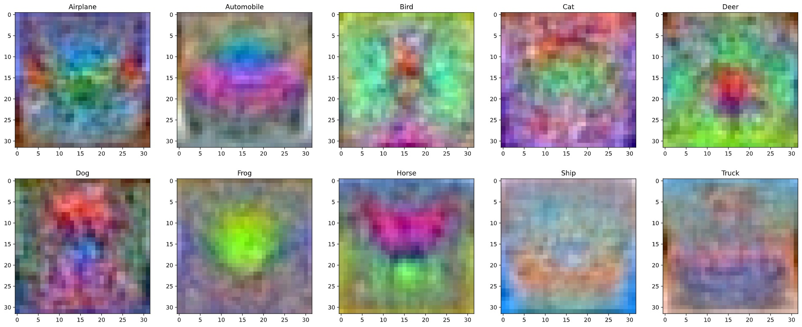
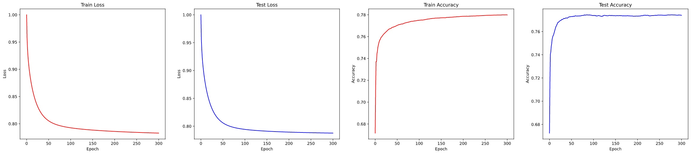
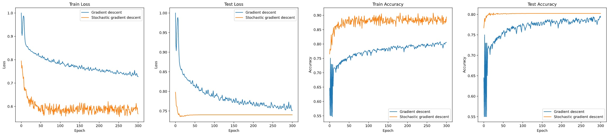

# Classification Model for CIFAR10 Dataset

Example images of CIFAR10 dataset of which contains 50,000 32×32×3 training images of 10 classes; Airplane, Automobile, Bird, Cat, Deer, Dog, Frog, Horse, Ship and Truck.

Here I have trained a `Linear Classifier`, `2 Layer Fully Connected NN` and a `CNN` model to classify images in `CIFAR-10` dataset.

#### Trained Weights of the Linear Classifier

#### Resulted training and testing losses and accuracies for the Linear Classifier model

#### Comparison of 2 Layer Fully Connected Neural Network with and without using Stochastic Gradient Descent

